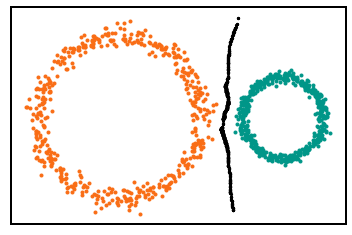
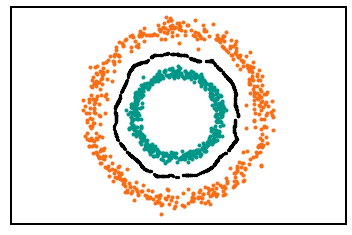
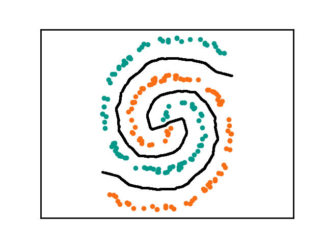
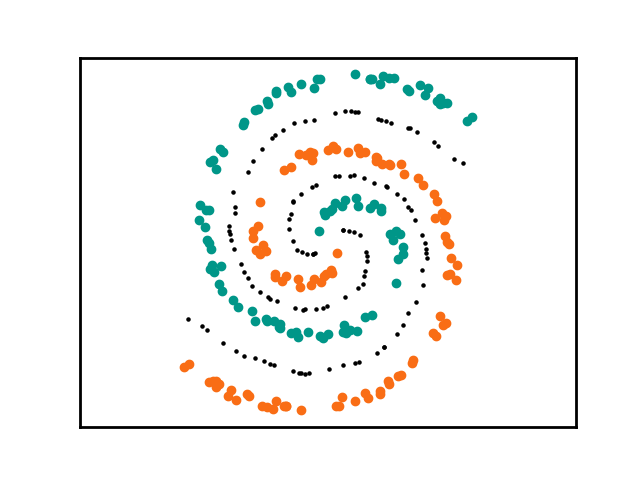
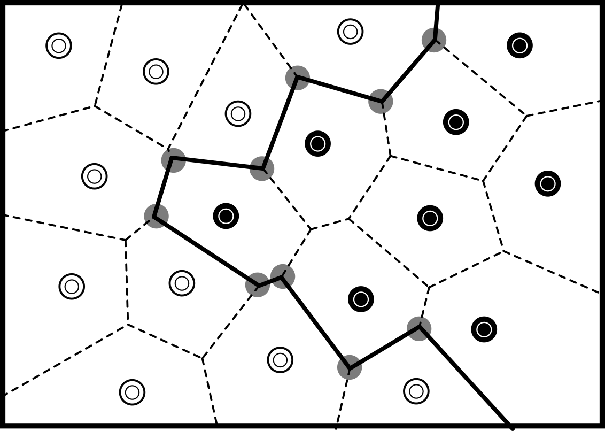
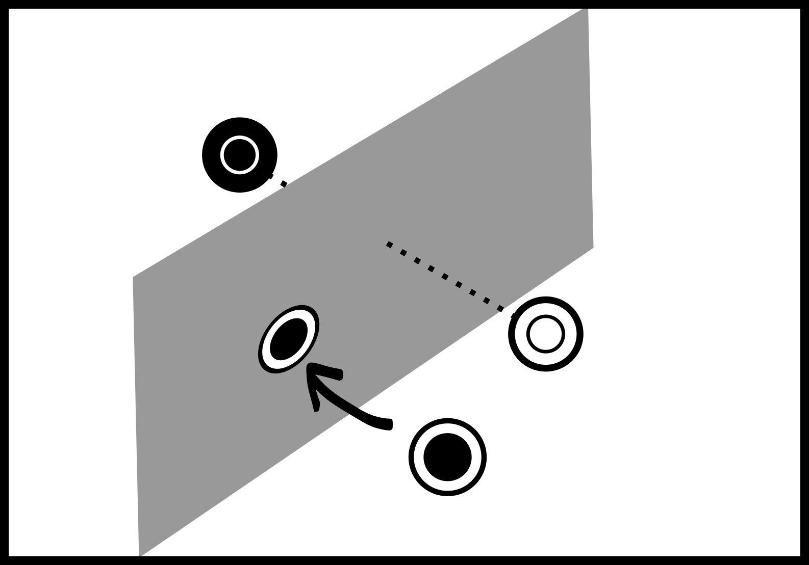
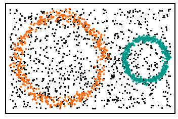
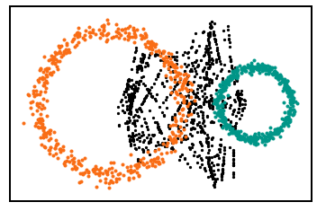
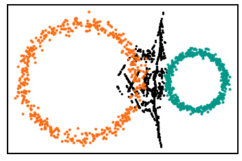

# Decision Boundary Sampler (DBS)

[](https://pepy.tech/project/dbsampler) [](https://github.com/Antonio-Leitao/dbsampler/blob/main/LICENSE) [](https://github.com/Antonio-Leitao) [](https://pypi.org/project/dbsampler/) [](https://www.python.org/)

</img>

### Contents
- [Installation](#installation)
  - [Compiling from source](#compilation-from-source)  
- [Usage](#usage)
  - [Sparse](#sparse)
- [How does it work](#how-does-it-work)
- [Performance](#performance)
- [Citing](#citing)


<p align="center">
  
  
</p>

DBSampler is a package to sample points in the decision boundary of  classification problems (binary or multiclass). It is theorically exact and efficient for very high dimensions. The guarentees:

  - Returns a sample of points uniformly distributed in the decision boundary.
  - Number of points is user defined. More points for a denser sample, less for a faster run.
  - The points are guarenteed to come from the edges of the condensed Voronoi Diagram (more below).


## Installation

Pre-built packages for many Linux, Windows, and OSX systems are available
in [PyPI](https://pypi.org/project/dbsampler/) and can be installed with:

```sh
pip install dbsampler
```
On uncommon architectures, you may need to first
[install Cargo](https://doc.rust-lang.org/cargo/getting-started/installation.html) before running `pip install vlmc`.

### Compilation from source

In order to compile from source you will need to [install Rust/Cargo](https://doc.rust-lang.org/cargo/getting-started/installation.html) and [maturin](https://github.com/PyO3/maturin#maturin) for the python bindings.
Maturin is best used within a Python virtual environment:

```sh
# activate your desired virtual environment first, then:
pip install maturin
git clone https://github.com/antonio-leitao/dbsampler.git
cd vlmc
# build and install the package:
maturin develop --release
```

## Usage
```python
import dbsampler
cover = dbsampler.dbs(data=X,labels=y,n_points=1000,n_epochs=5, sparse=True, parallel=True) 
```
**Parameters:**
-  ``data``: numpy array of shape (samples,features) with the points of every class.
 -  ``labels``: 1-dimensional numpy array with labels of each points. Array must be flattened.
 -  ``n_points``: This determines the number of points sampled from the decision boundary. More points equates for a denser sample but slows the algorithm. Default is 1000.
 -  ``sparse``: boolean (default `True`), whether to remove points that are in the same Voronoi Edge or not.
 -  ``parallel``: boolean (default `True`)
 
**Returns:**
 -  ``cover``: numpy array (n_points, n_features) of points in the decision boundary.

### Sparse
Passing the ``sparse`` flag will remove the cover points that fall on the same Voronoi Edge, favoring the first one.
This can drastically reduce the number of points while maintaining a uniform and complete cover of the decision boundary.
Below is the example of ``5000`` points sampled (left) and the same points with ``sparse=True``.

<p align="center">
  
  
</p>

## Performance
DBSampler is written in Rust pre-builds the binaries for Windows, MacOS and most Linux distributions.
DBSampler achieves very high performance due to effective parallization and BLAS support.
Currently manages to calculate a cover of `5 000` points given `10 000` points in `500` dimensions in less than 10 seconds.

More improvments are planned targeted situations where the number of samples times the dimensions is higher than 1 billion where the current implmentations starts to slow down.

<p align="center">
  
</p>

## How does it work?
For an in-depth explanation check at our [paper](https://openreview.net/forum?id=I44kJPuvqPD). The algorithm aims at sampling uniformly points from the edges of Voronoi Cells belonging to points of different classes. The union of these edges is the decision boundary that maximizes the distance between classes.
 
<p align="center">
  
</p>

 
 It starts by building an initial uniform sample of the space containing ``n_points``. It then iterativelly "pushes" each point to the hyperplane orthogonal to the one between its closest neighbors of different classes.
 
<p align="center">
  
</p>
 
Sketch of proof of convergence. At each iteration in ``n_epochs``:
 1. If both nearest neighbours have adjacent Voronoi Cells then, after projection the point is in the decision boundary (by construction).
 2. Else then there must exist a point from class A (or not A) that is the new nearest neighbour (by definition of Voronoi Cells).
 
<p align="center">
  
  
  
  
</p>
 

## Citing
If you use DBSampler in your work or parts of the algorithm please consider citing:
```
@inproceedings{petri2020on,
               title={On The Topological Expressive Power of Neural Networks},
               author={Giovanni Petri and Ant{\'o}nio Leit{\~a}o},
               booktitle={NeurIPS 2020 Workshop on Topological Data Analysis and Beyond},
               year={2020},
               url={https://openreview.net/forum?id=I44kJPuvqPD}
}
```
In the paper above you can find the pseudocode of the algorithm along with the proof of convergence. A complete paper about the method is coming soon.
