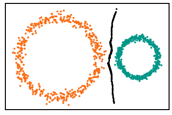
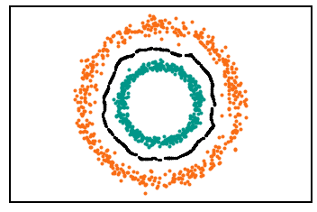
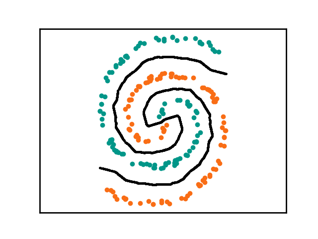
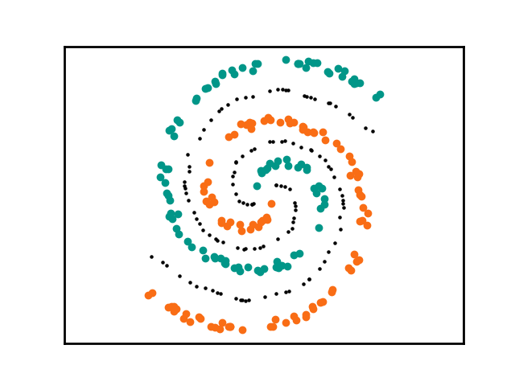
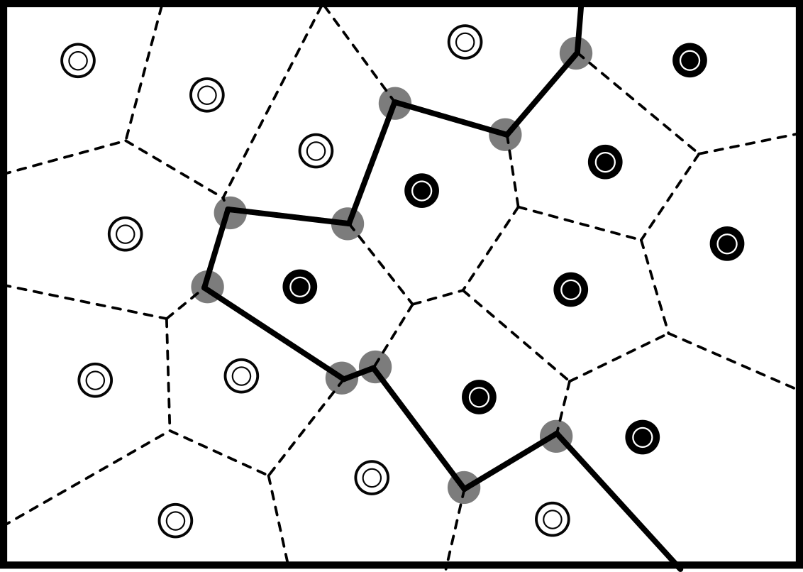
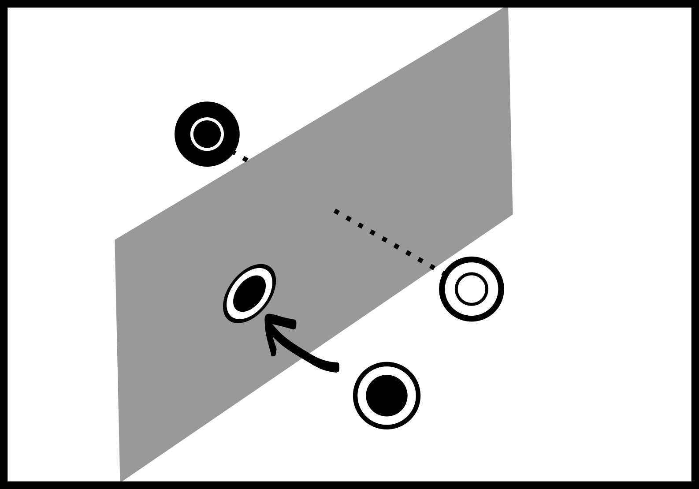
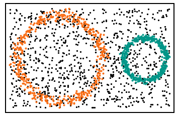
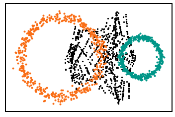
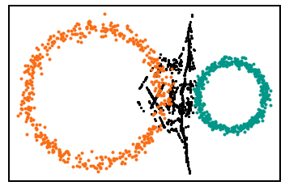
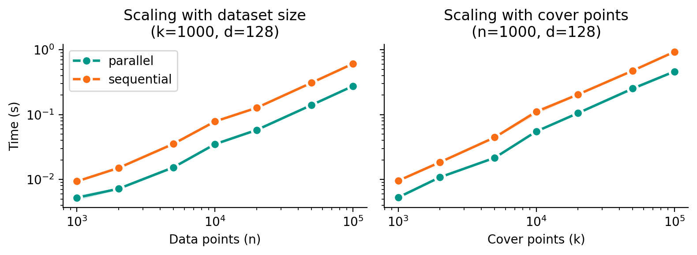

<p align="center">
  </img>
</p>

<div align="center">
<h3 max-width='200px' align="center">Decision Boundary Sampler</h3>
  <p><i>Sample the decision boundary of classification problems<br/>
  Blazingly fast geometric sampling<br/>
  Built with Rust</i><br/></p>
  <p>
    
  </p>
</div>

#

### Contents

- [Installation](#installation)
  - [Compiling from source](#compilation-from-source)
- [Usage](#usage)
  - [Sparse](#sparse)
- [How does it work](#how-does-it-work)
- [Performance](#performance)
- [Citing](#citing)

<p align="center">
  
  
</p>

DBSampler is a package to sample the decision boundary of binary or multiclass datasets. It is designed to remain efficient in high dimensions:

- Lets the user request how many boundary points to sample. More points give broader coverage, while fewer points run faster.
- Iteratively moves each point onto a boundary between Voronoi regions belonging to different classes.
- Can keep one representative for each distinct boundary region it finds.

## Installation

Pre-built packages for MacOS, Windows and Linux systems are available on [PyPI](https://pypi.org/project/dbsampler/) and can be installed with:

```
pip install dbsampler
```

On uncommon architectures, you may need to first
[install Cargo](https://doc.rust-lang.org/cargo/getting-started/installation.html) before running `pip install dbsampler`.

### Compilation from source

In order to compile from source you will need [Rust/Cargo](https://doc.rust-lang.org/cargo/getting-started/installation.html) and [maturin](https://github.com/PyO3/maturin) for the Python bindings.
Maturin is best used within a Python virtual environment:

```bash
# activate your desired virtual environment first, then:
pip install maturin
git clone https://github.com/antonio-leitao/dbsampler.git
cd dbsampler
# build and install the package:
maturin develop --release
```

## Usage

```python
import dbsampler
import numpy as np

cover = dbsampler.dbs(
    data=X,
    y=y,
    n_points=1000,
    max_iter=100,
    tol=1e-6,
    sparse=True,
    parallel=True,
    seed=42,
    batch_size=256,
    max_batches=20,
)
```

**Parameters:**

- `data`: NumPy array of shape `(n, d)` with dtype `float32` or `float64`. The core computation uses normalized, contiguous `float32` data.
- `y`: 1-dimensional array or list of integer class labels, length `n`.
- `n_points`: number of points to sample from the decision boundary. More points give a denser sample but increase runtime. Default `1000`.
- `max_iter`: maximum number of projection iterations. Default `100`.
- `tol`: per-point convergence threshold on squared displacement. Default `1e-6`.
- `sparse`: if `True` (default), aims to return `n_points` distinct boundary points by sampling additional batches when duplicates are found.
- `parallel`: if `True` (default), uses [rayon](https://github.com/rayon-rs/rayon) to parallelize the per-point nearest-neighbor search and projection steps across CPU cores. The BLAS matrix multiplications are multithreaded independently of this flag.
- `seed`: optional integer seed for reproducible results. When `None` (default), initialization is random. Set to a fixed value (e.g. `seed=42`) for deterministic runs.
- `batch_size`: maximum number of points processed together when `sparse=True`. Default `256`.
- `max_batches`: hard limit on the number of batches when `sparse=True`. Default `20`.

**Returns:**

- `cover`: list of lists, each of length `d` — the sampled boundary points (as `float32` values). With `sparse=True`, the list can be shorter than `n_points` if the requested number of distinct boundary regions cannot be found before `max_batches` is reached.

### Sparse

Passing `sparse=True` returns at most one representative for each distinct boundary region. The sampler processes points in batches and, when duplicates become common, uses the previous results to favor parts of the input space that have produced new regions efficiently. Exact nearest-neighbor search and convergence checks are still used for every selected point. If it cannot find `n_points` distinct regions before reaching `max_batches`, it returns those it found and emits a warning.

With `sparse=False`, the sampler generates `n_points` once without removing duplicates. Below are examples of dense sampling (left) and sparse sampling (right).

<p align="center">
  
  
</p>

## How does it work?

For an in-depth explanation check our [paper](https://openreview.net/forum?id=I44kJPuvqPD). The algorithm samples the shared boundaries of Voronoi regions belonging to points of different classes. These boundary pieces form the decision boundary of a 1-nearest-neighbor classifier.

<p align="center">
  
</p>

It starts by sampling points uniformly inside the bounds of the data. It then iteratively projects each point onto the bisecting hyperplane between its two nearest neighbors of different classes. With `sparse=True`, this work is split into batches so duplicates can be replaced by new samples.

<p align="center">
  
</p>

**Why the iteration moves toward the boundary.** At each iteration, the sampler finds the nearest data point and the nearest point from a different class, then moves the query point onto the plane halfway between them. It checks the neighbours again after the move. If the same pair remains, the query point is on their shared boundary; otherwise the process continues with the new pair. A small movement can also stop a point approximately, and `max_iter` remains a hard limit.

<p align="center">
  
  
  
  
</p>

## Performance

DBSampler is written in Rust with BLAS-accelerated linear algebra (via Accelerate on macOS, OpenBLAS on Linux/Windows). The core dot-product and matrix-multiply operations use `cblas_sgemm` and `cblas_sdot`, and the algorithm automatically switches to a tiled iteration strategy when the score matrix would exceed 32 MB, avoiding allocation of the complete matrix for large datasets.

With `parallel=True`, the per-point nearest-neighbor search and bisector projection are distributed across CPU cores using rayon. The BLAS matrix multiplications are multithreaded independently. Each point stops independently once it meets the displacement tolerance or keeps the same neighboring pair after projection.

Pre-built binaries are available for Windows, macOS and most Linux distributions.

<p align="center">
  
</p>

## Citing

If you use DBSampler in your work or parts of the algorithm please consider citing:

```
@inproceedings{petri2020on,
               title={On The Topological Expressive Power of Neural Networks},
               author={Giovanni Petri and Ant{\'o}nio Leit{\~a}o},
               booktitle={NeurIPS 2020 Workshop on Topological Data Analysis and Beyond},
               year={2020},
               url={https://openreview.net/forum?id=I44kJPuvqPD}
}
```

In the paper above you can find the pseudocode of the algorithm and its convergence discussion.

## License

DBSampler is distributed under the [3-clause BSD license](LICENSE.md).
